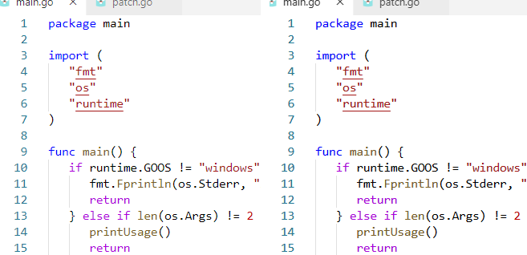
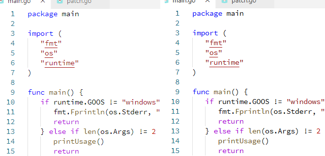

# VSCode Font Patch

A command line utility to patch a Visual Studio Code installation on **Windows**, slightly enhancing the font rendering.

## Comparison

* Using Consolas font (original, patched)

* Using Source Code Pro font (original, patched)

## Usage

Close VSCode and run the command line, passing the VSCode installation path as the single argument.

Example:

    vscode-font-patch "C:\My stuff\Microsoft VS Code"

When opening VSCode again, you will see a warning about a corrupted installation. If you don't ignore it, the changes made by the patch will be reverted.

To revert the patch, simply run VS Code installer again.

## Build

To build the program, run:

    go build -ldflags "-s -w"
